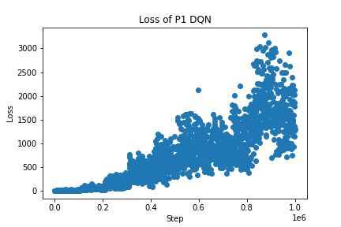

# Connect4-DQN
Connect4 AI using DQN\

## Procedure

Two DQN agents were trained, one agent being the player that goes first, and the other being the player that goes second. Each agent was trained against a random opponent. The reward function used in this experiment has intermediate rewards: the agent is rewarded for making longer connections and blocking the opponent.

## Results

Although the loss function of the DQN's grew (see below), the agents were surprisingly successful. P1 agent had a 96.6% win rate against a random opponent and P2 agent had a 94.4% win rate against a random opponent. P1 and P2 agents are stored in *p1.dat* and *p2.dat*, respectively.

